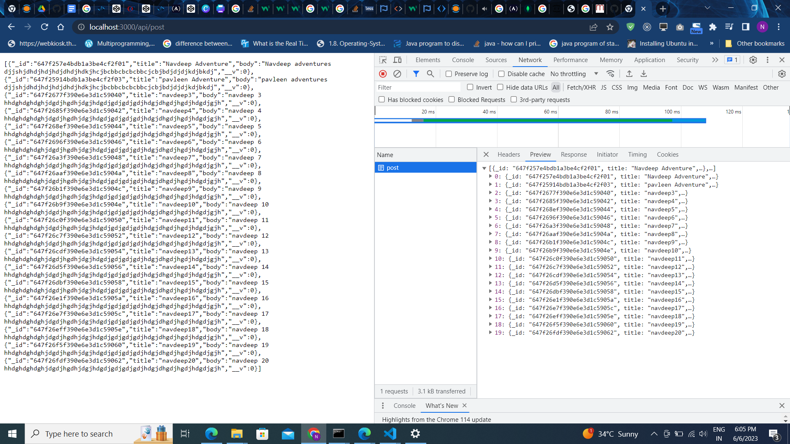

# a simple server using Express and connect with backend and create an endpoint “/post” which sends 20 posts

## OutPut

### URL - http://localhost:3000/api/post

> Kindly enter your database credentials in env file to use this api